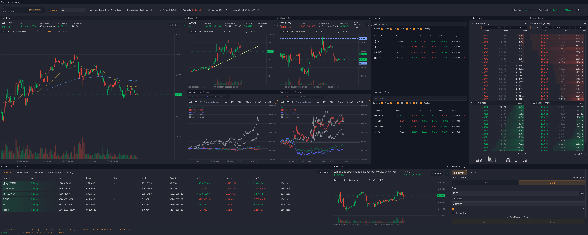

# Kerosene

Kerosene is a GPU-accelerated desktop trading terminal for [Hyperliquid](https://hyperliquid.xyz), built in Rust with [iced](https://iced.rs).

> **Risk notice:** Kerosene is trading software. Use it at your own risk, test with small order sizes first, and verify behavior before relying on it with real funds. Nothing in this project is financial advice.

## Preview

<p align="center">
  
</p>

<table>
  <tr>
    <td width="33%" valign="top">
      
      <br>
      <sub><strong>Compare markets.</strong> Overlay assets and keep related charts, books, and positions visible in one workspace.</sub>
    </td>
    <td width="33%" valign="top">
      
      <br>
      <sub><strong>Build the layout.</strong> Add charts, order books, watchlists, tools, and account panes as your workflow changes.</sub>
    </td>
    <td width="33%" valign="top">
      
      <br>
      <sub><strong>Make it yours.</strong> Switch between bundled themes or keep custom palettes for different desks and sessions.</sub>
    </td>
  </tr>
</table>

More screenshots, including alternate themes and focused feature views, are available in [assets/screenshots](assets/screenshots/).

## Documentation

Feature-specific guides live in [`docs/`](docs/):

- [Alfred](docs/alfred.md) — command palette behavior, natural-language market/limit/Chase order drafts, close-position commands, NUKE, and safety rails.
- [Chase Orders](docs/advanced-orders/chase-orders.md) — high-level behavior, user expectations, limits, and technical lifecycle details for Kerosene's client-side Chase order automation.
- [Trading Journal](docs/journal.md) — user-facing behavior, fill loading, trade aggregation, same-millisecond position-chain ordering, diagnostics, and regression coverage.
- [TWAP Orders](docs/advanced-orders/twap-orders.md) — user behavior, safety rails, slice execution, persistence, and technical lifecycle details for Kerosene's client-side TWAP order automation.

## Features

**Market Data**
- Real-time candlestick charts with multiple timeframes: 1m, 5m, 15m, 1h, 4h, 12h, 1D, 3D, 1W, 1M
- Multi-chart support for viewing several assets side by side
- Live L2 order book with configurable tick grouping
- Real-time mid prices for listed assets
- Funding rate, open interest, and mark/oracle price display for perpetual markets
- 24h volume and mid price display for spot markets

**Trading**
- Perpetual and spot market support, including main dex, HIP-3 dexes, and spot pairs
- Limit and market orders with reduce-only support for perpetuals
- Drag-to-move limit orders on the chart
- Right-click or use the chart order-line close button to cancel orders
- One-click midpoint price fill for limit orders
- Chase orders: client-side limit orders that reprice at the best bid/ask until filled, with partial-fill tracking
- TWAP orders: client-side scheduled IOC slices with hard price ranges, slice logs, and persisted completed-order history
- Close-position menu for 25%, 50%, or 100% via market or limit order
- Nuke button to close all positions at market
- Alfred command palette for fast trading commands such as `buy $1k HYPE`, `chase $1k HYPE`, and `chase buy $1k HYPE`

**Portfolio**
- Live positions with real-time PnL calculated from streaming mid prices
- Open orders display with chart overlays for position entry and limit order lines
- Trade history and spot balances
- Account summary with live margin, equity, and notional exposure
- Wallet tracking and address-book views

**Interface**
- Resizable pane grid layout for charts, order books, account views, order entry, and tools
- Click a chart to switch the active trading symbol for order entry and order book
- Symbol search across main dex, HIP-3 dexes, and spot pairs
- Clickable position symbols to switch chart view
- Persistent config for layout, symbols, wallets, hotkeys, settings, and themes
- Dark theme and custom theme support

## Prerequisites

- **Rust** edition 2024; Rust 1.85+ recommended
- A C linker and system libraries for your platform:
  - **Linux:** `build-essential`, `pkg-config`, `libssl-dev`, `libasound2-dev`, and a GPU-capable display server: X11 or Wayland
  - **macOS:** Xcode Command Line Tools: `xcode-select --install`
  - **Windows:** MSVC Build Tools via Visual Studio

## Build

```sh
# Debug build
cargo build

# Release build, recommended for daily use
cargo build --release
```

## Run

```sh
# Debug
cargo run

# Release
cargo run --release
```

The terminal opens with a default chart view. To trade:

1. Enter your Ethereum wallet address and connect.
2. Enter a Hyperliquid agent private key.
3. Select a symbol from search or click a position symbol.
4. Use the order-entry pane to place orders.

## Security and Secrets

- Agent private keys are used locally to sign Hyperliquid actions.
- The key should never be committed or shared.
- Kerosene stores secrets in the OS keychain where available, or in encrypted config when selected.
- Avoid storing secrets in plaintext config files.
- If a key, wallet-private material, or API token is exposed, rotate it immediately.

Optional integrations may require API keys:

- Hydromancer: liquidation and tracked-trade streams
- HyperDash: liquidation heatmap data

## Test and Validate

```sh
cargo fmt -- --check
cargo check
cargo test
cargo clippy --all-targets --all-features -- -D warnings
```

Additional manual GUI/websocket test harnesses live in `tests/manual/`. They are preserved for development reference and are not part of the standard Cargo test suite yet.

For a headless Linux GUI smoke test, install `xvfb` and the XKB/X11 support libraries, then run:

```sh
timeout 20s xvfb-run -a cargo run
```

A timeout after the window starts is acceptable; a panic is not.

## Package for Linux

A convenience script handles the packaging workflow:

```sh
# Build .deb, .rpm, and .AppImage where toolchains are available
./scripts/package.sh all

# Or build individually
./scripts/package.sh deb
./scripts/package.sh rpm
./scripts/package.sh appimage
```

The script builds the release binary if needed, installs missing Rust packaging tools such as `cargo-deb`, and places output files in `target/`.

### .deb: Debian / Ubuntu

The `.deb` is written to `target/debian/kerosene_<version>_amd64.deb`. Install with:

```sh
sudo dpkg -i target/debian/kerosene_*_amd64.deb
```

It installs the binary to `/usr/bin/kerosene`, plus desktop entry and icons.

### .rpm: Fedora / RHEL / openSUSE

The `.rpm` target requires RPM build tools, such as `rpm-build` on
Fedora/RHEL/openSUSE or `rpm` on Debian/Ubuntu. The package is copied to
`target/rpm/kerosene-<version>-1*.rpm`. Install with:

```sh
sudo dnf install ./target/rpm/kerosene-*.rpm
# or
sudo zypper install ./target/rpm/kerosene-*.rpm
```

It installs the binary to `/usr/bin/kerosene`, plus desktop entry and icons.

### .AppImage

The `.AppImage` is written to `target/Kerosene-<version>-<arch>.AppImage`. Run directly:

```sh
chmod +x target/Kerosene-*-*.AppImage
./target/Kerosene-*-*.AppImage
```

### Manual packaging

If you prefer not to use the script, inspect `scripts/package.sh` for the exact commands. It calls `cargo-deb`, `rpmbuild`, and `appimagetool` for Linux packaging.

## Package for macOS

macOS packaging must be run on macOS. It uses built-in Apple command-line tools
(`codesign`, `hdiutil`, `sips`, `ditto`, and `plutil`) plus Cargo to build a
release binary, assemble `Kerosene.app`, apply an ad-hoc signature, and create a
compressed DMG.

```sh
./scripts/package-macos.sh

# Equivalent wrapper command
./scripts/package.sh macos
```

The DMG is written to `target/Kerosene-<version>-macos-<arch>.dmg`, for example
`target/Kerosene-0.1.8-macos-arm64.dmg` on Apple Silicon.

No Apple Developer account is required for this packaging path. The output is
ad-hoc signed, but it is not Developer ID signed or notarized. Macs receiving
the DMG may show Gatekeeper warnings on first launch; users can open it from
Finder's context menu or approve it in System Settings > Privacy & Security.

Optional environment overrides:

```sh
BUNDLE_ID=com.example.kerosene ./scripts/package-macos.sh
MACOSX_DEPLOYMENT_TARGET=12.0 ./scripts/package-macos.sh
```

## Package for Windows

Windows production builds use the MSVC target and emit a portable zip plus an MSI installer:

```powershell
pwsh ./scripts/package-windows.ps1
```

Release builds must be Authenticode-signed. The packaging script signs artifacts when `WINDOWS_SIGNING_CERT_PFX_BASE64` and `WINDOWS_SIGNING_CERT_PASSWORD` are set, and fails unsigned release builds when invoked with `-Release`.

## Config

Settings are persisted to a JSON file at the platform config directory:

- **Linux:** `~/.config/kerosene/config.json`
- **macOS:** `~/Library/Application Support/kerosene/config.json`
- **Windows:** `%APPDATA%\kerosene\config.json`

Saved state includes wallet address, active symbol, chart symbols/timeframes, order settings, book tick size, layout, themes, hotkeys, address-book metadata, and pane ratios. Agent, Hydromancer, and HyperDash secrets are stored separately through the configured secret-storage backend.

## Architecture

Kerosene is a single-binary application following the Elm Architecture as used by iced:

- **State:** `TradingTerminal` holds application state.
- **Messages:** `Message` defines user, network, timer, and persistence events.
- **Update:** `update()` processes messages and returns side-effect tasks.
- **View:** view functions render UI as pure functions of state.

Real-time data arrives via WebSocket subscriptions for candles, books, asset context, user data, and optional integrations. Charts are rendered through iced canvas with cached geometry layers.

## Key Modules

- `src/main.rs`: application entrypoint and module wiring
- `src/app_state.rs`: top-level state
- `src/message.rs`: application messages
- `src/api/`: REST API types and fetch functions
- `src/ws/`: WebSocket streams and managers
- `src/account*/`: account state, account API, account views, profile switching
- `src/chart*/`: chart rendering, interaction, viewport, overlays, indicators
- `src/order_*`: order entry, quick orders, chase orders, move-order flows, result handling
- `src/signing/`: EIP-712 signing and Hyperliquid action payloads
- `src/config/`: config schema, persistence, wallets, themes, secret references
- `src/secret_storage/`: keychain and encrypted secret loading/apply flows

## Key Dependencies

- `iced`: GUI framework with canvas, pane grid, async runtime, and SVG support
- `reqwest`: HTTP client for REST APIs
- `tokio-tungstenite`: WebSocket client for real-time streams
- `k256` and `sha3`: ECDSA signing for Hyperliquid actions
- `rmp-serde`: MessagePack serialization for Hyperliquid action wire format
- `serde` and `serde_json`: JSON serialization
- `dirs`: platform config-directory resolution
- `keyring`: OS keychain integration for secrets
- `rodio` and `notify-rust`: audio and desktop notifications

## License

Kerosene is licensed under the MIT License. See [LICENSE](LICENSE).
