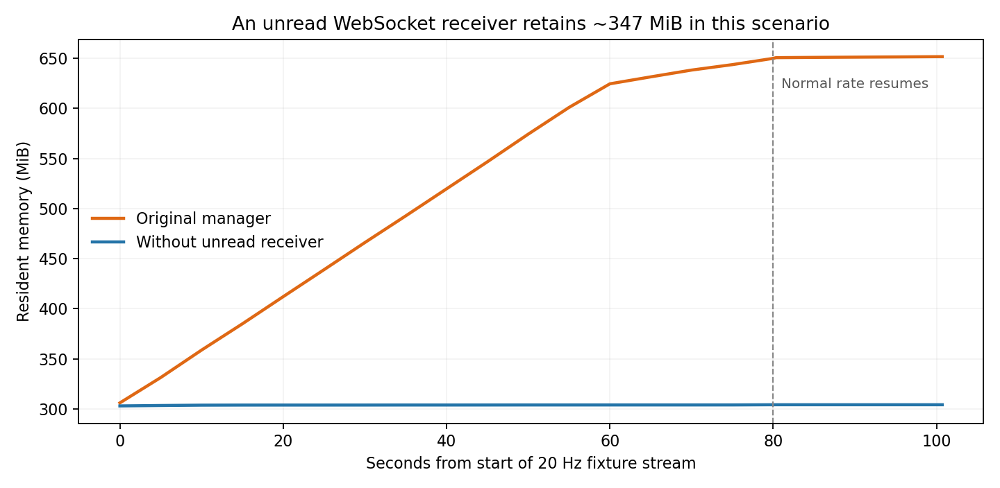

# End-to-end runtime and API performance audit

Date: 2026-09-24. Application: Kerosene 0.2.0. Baseline HEAD:
`ed7f7b4d`, **including the pre-existing uncommitted working-tree changes**.

## Revision check — 2026-09-24

**The measurements below describe the audited checkout, not the latest main
branch.** A follow-up commit review found that local `main` at `ed7f7b4d` was five
commits behind `origin/main` at `8a2024ed`; `git ls-remote` also confirmed that
commit as GitHub's current `main`. The original audit did not reconcile those
newer commits before presenting its findings.

**F1's hidden outcome-volume startup work is addressed by
[`8a2024ed`](https://github.com/nilesjarvis/kerosene/commit/8a2024eddb5c71ac24ee6f8c31d65a9520240fc6),
“fix: fetch outcome volumes only for open consumers.”** With no open Outcomes
widget or outcome chart, symbol discovery schedules no outcome-volume reads.
An open outcome chart requests only its own primary symbol; closed saved
canvases do not create demand. The implementation shares an in-flight batch,
aborts obsolete work, and limits outcome fetch concurrency to two. A visible
Outcomes widget still requests all eligible contracts, subject to that limit
and the shared read budget.

Validation on the clean fix worktree at `8a2024ed`:
`cargo test --locked --bin kerosene outcome_volume` — **19 passed, 0 failed**.
These cover startup without consumers, opening/closing widgets, canvas and
layout transitions, chart-only demand, stale results, concurrency and
cancellation. The desktop traces below were **not** rerun against this commit;
their request counts must not be attributed to the fixed version. F8's partial
failure semantics remain present in the reviewed fix.

The same revision check also found
[`232b5f4a`](https://github.com/nilesjarvis/kerosene/commit/232b5f4a5faf03edad3beae85704b05457722859),
“fix: share market reads and recover stalled candle streams,” absent from the
audited checkout but included in the newer branch. It adds shared read admission,
direct-request 429 cooldown, shared reads and candle recovery. Consequently
F3–F5 and the request-sharing portion of F7 require revalidation against that
implementation before being described as outstanding defects in current main.
The original evidence is retained below as a historical baseline.

## Integration validation — 2026-09-25

The outcome changes were integrated with `origin/main` at `8a2024ed`. The Skew
price/size/mid validation test now advances its contract deadline, so the
captured expiry cannot mask the validation it is intended to exercise. The
historical test and lint results below remain unchanged as audit evidence.

- `cargo test --release --locked --bin kerosene`: 4,282 passed, 0 failed,
  6 ignored.
- `cargo clippy --release --locked --all-targets --all-features -- -D warnings`:
  passed.
- `cargo fmt -- --check`: passed. Source/document whitespace checks passed;
  the retained `.diff` keeps its blank-line context prefixes.
- New Python files parse successfully and JSON fixtures/evidence are valid.
- The instrumented release build and offline native desktop suite passed all
  ten coverage checks, including startup, search, loaded history, candle/book
  delivery, screenshot completion, and no connected account or telemetry loss.
  Local run artifacts are in `target/e2e/pre-push-20260925/`.

These checks do not replace the historical desktop performance measurements
with a new benchmark or establish coverage for the untested workflows below.

## Assessment

A real, repeatable desktop test path now exists under [tests/e2e](../tests/e2e/README.md).
It runs the actual iced application, sends keyboard/mouse input, captures rendered
screenshots, and correlates process measurements with redacted network and update
telemetry. It also supports local HTTP/WebSocket fault injection.

The highest-priority problems in the audited snapshot are excessive cold-start
API demand, retained WebSocket payloads, and incomplete rate-limit/recovery
coordination. Ordinary
search and chart input handlers were comparatively inexpensive. Successful HTTP
transport and a green connectivity indicator do not establish usable chart data.

This is a measured audit of the public-data desktop path, backed by a full Rust
test run and a broader source review. **It is not a claim that every feature has
passed an end-to-end test.** Signed trading, connected account lifecycle, paid
integrations, disk persistence and other OSes remain explicit coverage gaps below.
No production application code was changed and no real order was submitted.

## Test environment and method

- Linux, dedicated Xvfb display at 1600×1000; no window manager/compositor.
- Optimized release builds of a copied source tree; normal application binary
  and user configuration left alone. A source hash manifest identifies the build.
- Vulkan requested. The memory baseline process was observed on the NVIDIA
  GeForce RTX 4090 through its matching `nvidia-smi` process entry.
- `--test` configuration: no saved accounts, credentials, OS keychain hydration,
  config saves, or persistent candle caches. Cold-start results are directly
  relevant to a fresh installation; repeated reads can overstate warm-disk-cache
  costs. Source hashes were checked again: production Rust files had not changed
  during these runs.
- Initial live launch used public Hyperliquid data. It was stopped after the
  startup burst and 429s became visible. A separate small capture made nine
  spaced, unauthenticated metadata reads for offline replay.
- Local replay retained the captured 1,108-symbol universe. Candle/book/tick
  data and HIP-3 quote contexts were synthetic. It returned explicit errors for
  unsupported endpoints and rejected exchange writes. This is a market-data
  fixture, not an exchange execution simulator.
- Timing wrappers measured synchronous update work, view construction and
  subscription construction. The exporter copied the existing bounded network
  log every 250 ms and recorded loss explicitly. No message contents, account
  addresses, request bodies, URLs, headers or credentials entered that exporter.

### What the numbers mean

CPU 100% means one logical core. RSS is process resident memory, not GPU memory.
Timing percentiles are upper bounds from logarithmic microsecond histograms.
HTTP completion/concurrency are measured **at response headers**; body transfer
and parsing finish later. View time excludes widget layout, canvas draw, GPU
execution and presentation. These measurements do **not** establish FPS or
input-to-pixel latency. Xvfb, generated data, instrumentation and other host work
limit performance generalization; the memory comparison controls the scenario
and changes only one ownership decision.

## Executed evidence

| Run | What actually ran | Principal result |
| --- | --- | --- |
| `run-01` | 16.803-second live cold launch; welcome screen only | 437 HTTP attempts, 253 HTTP 429s, 422 simultaneously awaiting headers. |
| `run-02` | Exploratory replay to locate controls | Excluded from performance conclusions: an initial fixture duplicated native mids across DEXes and did not support the latency probe. Both fixture issues were corrected. |
| `run-03` | 629.1-second replay, 168 recorded actions, screenshots and injected failures | No panic or telemetry loss; 595 HTTP attempts, four deliberately injected 429s, 25,294 incoming WS frames. |
| `memory-baseline` | Automated identical warmup → 80-second 20 Hz stream → cooldown | Fast-stream RSS 305.94 → 650.65 MiB; all ten coverage checks passed. |
| `memory-comparison` | Same scenario, staged manager without retained idle receiver | Fast-stream RSS 302.91 → 304.07 MiB; all ten coverage checks passed. |

`run-03` exercised onboarding; symbol search and selection; 1m/5m chart switching;
pan/zoom; Screener opening/sorting/scrolling/closing; Console opening/pause/scroll/
resume/closing; delayed symbol switches; 429 and malformed-body recovery; WS
disconnect/reconnect; chart detach/resize/close; Settings navigation through
Network, Layouts and Hotkeys; chart creation/search/load/removal; and the TWAP
quantity form with disconnected trading controls disabled.

The scripted driver sends real X events. Message counters and screenshots verify
the successful interactions; a dispatched click alone is not counted as a pass.
One exploratory action sequence selected NIL through the Screener, so later
failure captures show NIL rather than BTC. The final delayed-switch capture
correctly shows HYPE. This does not demonstrate a symbol-selection defect.

### Observed responsiveness

| Work in `run-03` | Calls | Mean | Maximum | Interpretation |
| --- | ---: | ---: | ---: | --- |
| Symbol search update | 25 | 0.460 ms | 0.677 ms | No expensive search handler observed. |
| Chart viewport update | 15 | 0.016 ms | 0.031 ms | Pan/zoom state changes were cheap. |
| Chart timeframe update | 2 | 0.072 ms | 0.079 ms | Excludes asynchronous history fetch. |
| Order quantity update | 3 | 0.036 ms | 0.038 ms | Only disconnected form editing tested. |
| `WsUserDataUpdate` | See summary | ~1.6 ms | 18.735 ms | Dominant cumulative update cost. |
| View construction | See summary | <1 ms overall | 6.140 ms | Not a frame-time measurement. |

The exploratory 20 Hz phases averaged 102.95% CPU with Screener open and 91.36%
after it closed. Their symbol/filter state was not identical, so that difference
is suggestive rather than a controlled attribution. The automated single-chart
baseline averaged 93.66% CPU during its fast-stream phase and 11.06% in cooldown.
The faster stream is a deliberate local stress condition, not measured normal
exchange traffic.

## Findings

### F1 — P1 in audited snapshot; addressed in `8a2024ed`: hidden outcome-volume startup work

**Current status:** the newer commit addresses the no-consumer startup fan-out,
with source review and 19 focused tests passing. See the revision check above.
The following measurements describe the older audited snapshot only.

**Observed live and attributed in replay.** The welcome screen triggered 434
HTTP sends during the first second. The final live trace contained 415 candle
requests: 165 returned 200 and 250 returned 429. Three additional order-book
reads were rate limited. No user had entered the terminal or opened Outcomes.

Symbol discovery schedules `request_outcome_volume_refresh()`. It selects all
selectable, non-hidden outcome symbols, regardless of whether their data is
visible, then `join_all` starts a candle request for every contract. Local replay
attributed 410 candle reads to outcome contracts; initial chart/macro history
accounts for the other cold-start candle requests. This is not solely a UI issue:
background volume discovery competes with the visible order book and chart.

The 415 candle attempts represent at least **8,300 units of nominal request
weight**, before response-item additions. That is attempted demand, not a claim
about weight actually charged to failed requests. Hyperliquid documents a shared
1,200/minute IP budget and a base weight of 20 for these reads. See the
[official limits](https://hyperliquid.gitbook.io/hyperliquid-docs/for-developers/api/rate-limits-and-user-limits).
Other traffic sharing the public IP was not measured; the application's own
nominal demand already exceeds the documented budget by a wide margin.

**Remedy:** lazy-load visible/prioritized outcome volumes; use an aggregate
provider field if it supplies the required semantics; otherwise queue bounded
work behind a shared weighted budget, reuse fresh results, and cancel obsolete
work. Startup should reserve capacity for essential visible data.

**Acceptance:** a fresh launch without an Outcomes consumer starts no
universe-wide outcome candle sweep; cold startup stays within a conservative
weighted budget and visible data is not starved by background discovery.

Evidence: [dispatch](../src/market_update/symbols.rs) line 680;
[selection](../src/market_update/symbols/outcome_volumes.rs) line 28;
[concurrent fan-out](../src/api/outcome_volume.rs) lines 15–48.
Unchanged metadata returns early at `symbols.rs:499`, so this audit does **not**
claim the entire burst repeats on every 120-second metadata tick.

### F2 — P1: an unread broadcast receiver retains a large history of parsed frames

**Observed growth; isolated comparison supplied.** The Hyperliquid manager stores
`msg_rx` solely to call `resubscribe()` for clients; it never consumes this
receiver. Every broadcast therefore retains one unread reference until a slot is
overwritten. The configured capacity is 10,000; the pinned Tokio implementation
rounds that to 16,384 slots. Retained `Arc<Value>` payloads include parsed JSON
allocation overhead, not just wire bytes.

In the controlled baseline, 80 seconds of the local faster stream grew RSS by
344.71 MiB, from 305.94 to 650.65 MiB. Memory remained around 651.64 MiB after
20 seconds at the normal fixture rate. The earlier interaction run showed the
same growth-and-plateau pattern. This is bounded retention, not evidence of an
unbounded leak.

The comparison build changes only the staged Hyperliquid manager to retain the
sender and create consumers with `subscribe()`, allowing the initial receiver to
drop. RSS then stayed at 302.91–304.07 MiB through the same 80-second load and
remained at 304.07 MiB after cooldown: **347.57 MiB less final RSS** than the
baseline. Both runs passed the same ten checks and had zero telemetry loss.
CPU remained similar (93.66% versus 94.77%), separating the retention fix from
the market-update CPU hotspot. This strongly supports receiver ownership as the
cause of the measured retention, within this workload and host.

The [summaries and exact experimental diff](audit-evidence/2026-09-24/README.md)
are retained with the report.
Hydromancer has the same ownership pattern; its actual runtime cost was not
measured because no key was supplied.

**Remedy:** remove idle receiver retention; size buffers by recovery requirements
and bytes; prefer per-topic replaceable snapshots for market data while keeping
order/fill delivery semantics explicit. Validate reconnect and subscription
lifetime behavior before adopting the experimental change.

Evidence: [HL manager](../src/ws/manager.rs) lines 133, 198–223;
[Hydromancer manager](../src/ws/hydromancer/manager.rs) lines 115, 225–279;
`tests/e2e/prepare.py --no-idle-receiver` contains the reviewable experiment.

### F3 — P1: direct API traffic has no shared budget or shared 429 cooldown

**Confirmed source design and fault test.** Direct `send_info` attempts execute
immediately; pooling is not request scheduling. The proxy route has cooldowns and
`Retry-After` handling, but those protections do not cover the direct path used
in this session. Feature-specific limits cannot coordinate startup, history,
account reads and analytics competing on the same IP.

With a local `429` and `Retry-After: 60`, the chart made four attempts at offsets
0, 1.037, 4.064 and 12.099 seconds. There is bounded exponential-like retry delay,
but it does not respect this provider cooldown. Hyperliquid candle errors are
all classified retryable, including permanent response-shape failures.

**Remedy:** preserve typed status/retry metadata and coordinate requests at the
transport/provider boundary. Enforce concurrency, weights and cooldowns with
priority for trading safety and reconciliation. Do not automatically replay
non-idempotent exchange writes. Other processes can share the IP budget.

**Acceptance:** after a 429, subsequent eligible reads wait for the shared
cooldown; permanent parse/validation failures do not enter the same retry policy;
background demand cannot exhaust reserved critical capacity.

Evidence: [direct/proxy split](../src/api/proxy.rs) line 104;
[retry delay](../src/chart_state/candles.rs) line 191;
[retry classification](../src/chart_update/candles/loaded.rs) line 490.

### F4 — P1: history recovery stops after the short retry sequence

**Observed.** After exhausting those four 429 responses, the fixture recovered.
During the next 63.36 seconds, all 253 telemetry snapshots still reported a chart
fetch error and only one or two forming candles. Streaming continued, but usable
historical data did not return. A later user-triggered change restored history.
The chart correctly displayed its local stale/unverified warning; this was not a
crash or an invisible total failure.

**Remedy:** keep a per-series recovery state after the fast retry budget is
exhausted. Schedule slow, jittered revalidation under the shared provider budget,
retain appropriate display data, and let a healthy reconnect/cooldown expiry
trigger recovery without repeatedly clearing the chart.

**Acceptance:** failed history becomes usable after service recovery without
requiring a symbol/timeframe switch or manual reload, with bounded retries.

Evidence: [failure handler](../src/chart_update/candles/loaded.rs) lines 231–270;
[live candle path](../src/chart_update/candles/ws.rs);
captures `12-rate-limited-chart`, `16-history-not-recovered`.

### F5 — P1: comparison-series history failure can disable its live stream

**Source-confirmed; not driven through the desktop in this audit.** The current
comparison-series error handler sets `series.loaded = false`, discards the error,
and supplies no retry. Subscription construction requires `series.loaded`.
A failed historical read therefore also prevents that series from receiving
live updates. This remains consistent with the earlier
[market-data audit](market-data-pipeline-audit.md).

**Remedy/acceptance:** separate historical readiness from live subscription
eligibility; preserve the error and schedule bounded recovery. A failed member
must reconnect/revalidate independently while successful siblings continue.

Evidence: [comparison result handler](../src/spaghetti_update/data/candles.rs)
line 71; [subscription gate](../src/subscription_state/market/spaghetti.rs).

### F6 — P2: market-data processing does repeated full-universe work

**Measured hotspot with a source-supported optimization opportunity.**
`WsUserDataUpdate` dominated synchronous update time. `handle_mids_update` clones
the exchange-symbol vector and muted set on every mids message, then refreshes
cross-feature display state and watchlist row caches. The session had 1,108
symbols and 11 DEX mids streams. The faster fixture repeatedly delivered complete
snapshots, exposing the cost even when prices barely changed.

**Remedy:** share immutable symbol metadata, precompute visibility/lookup indexes,
and update dependent rows only for changed symbols. Coalesce replaceable market
snapshots at a bounded presentation cadence, without coalescing lossless account
events. Profile these substeps before assuming the clone alone explains the cost.

Evidence: [mids update](../src/market_state/mids.rs) lines 19–60;
per-message timing summaries. The isolated memory experiment is not intended to
fix this CPU work.

### F7 — P2: obsolete selections keep paying for history requests

**Observed in delayed replay.** Three quick selections with two-second response
delay completed 16 candle-history requests across BTC, ETH and HYPE. No HTTP
cancellation was recorded, and total concurrent HTTP handlers reached 20 in the
phase. Final HYPE data displayed correctly: stale-result rejection works, while
the superseded work still consumes provider and parsing resources.

Each selected symbol also schedules four macro intervals (hour/day/week/month).
The cold H1 startup requests overlapping primary and macro history. Normal disk
cache behavior may reduce some repeated reads, but cannot combine concurrent cold
misses; this audit's `--test` mode intentionally disables that disk cache.

**Remedy:** share in-flight identical history requests, defer unnecessary macro
history, and make obsolete read tasks abortable or removable before dispatch.
Retain the existing stale-result guards. Avoid cancellation policies that would
drop a response still required by another chart.

Evidence: [macro fan-out](../src/chart_state/candles.rs) line 49;
[symbol switching](../src/market_update/symbols.rs);
local server phase records and `18-slow-switch-final` screenshot.

### F8 — P2: partial outcome-volume failures are reported as success

**Source-confirmed and relevant to the live partial-429 result.**
`fetch_outcome_volumes_24h` returns an error only when **every** requested symbol
fails. If some succeed, the failures are discarded. The result handler replaces
the volume map with the successful subset and clears the error. Users therefore
lack coverage/freshness information, and prior useful values may disappear.
The live telemetry proves partial HTTP failure; it did not export the live
volume-map state, so the exact visible live subset was not measured.

**Remedy/acceptance:** return success and failure coverage explicitly; merge
successful values, retain timestamped stale values as appropriate, and retry only
the missing subset. Partial completion must not be indistinguishable from a
complete universe snapshot.

Evidence: [partial-success handling](../src/api/outcome_volume.rs) lines 32–53;
[map replacement](../src/market_update/symbols/outcome_volumes.rs) line 60.

### F9 — P2: diagnostic health stops at the transport boundary

**Observed.** The malformed-response scenario returned HTTP 200 for four candle
attempts. The chart retained a fetch error, while the console's lifetime error
counter remained at the four earlier 429s. The status bar also displayed
`DATA HEALTHY` while history was incomplete: its health model uses stream/probe
liveness rather than all feature data readiness.

The existing console documents its scope accurately and protects sensitive data.
It is nevertheless insufficient by itself for the audit the user asked for.

**Remedy:** add separate redacted metrics for body/parse completion, validation
failure, stale-result rejection, data age, recovery state, queue age and provider
weight. Distinguish connectivity from usable feature data in diagnostics.
Measure input-to-presentation separately using render/present instrumentation.

Evidence: [HTTP completion](../src/network_activity/http.rs) lines 111–145;
[probe health](../src/status_bar/connectivity.rs) line 180;
[console scope](components/console.md).

### F10 — P2: tables rebuild rows outside the visible viewport

**Source-confirmed; bounded timing impact observed.** Symbol search and Screener
construct widgets for every filtered result. Screener also recomputes and sorts
its full row list for each view. Scroll clipping does not eliminate this
construction work. A view call reached 6.140 ms in the interaction run; no view
construction exceeded 16 ms. This is headroom consumption, not proof of dropped
frames. The faster-stream phases did not isolate the exact Screener contribution.

**Remedy/acceptance:** virtualize long lists or cache row models and build only
the viewport plus a small overscan. Benchmark 100/1,000/5,000 rows under a fixed
stream and compare input-to-presentation, not just handler duration.

Evidence: [symbol rows](../src/market_views/watchlist/rows.rs);
[Screener construction](../src/screener_views.rs) line 54;
[row model/sort](../src/screener_state.rs) line 348.

### F11 — P3: bounded console history cannot serve as a durable incident trace

**Observed limitation.** The ring holds 2,000 events, shared by HTTP and WS. The
fast-stream scenario can overwrite the startup incident in seconds. Lifetime
counters survive, but request-by-request evidence does not. Three current
metadata operations (`allPerpMetas`, `perpConciseAnnotations`, `outcomeTemplates`)
appear as `other`, obscuring attribution. The external audit exporter preserved
the events and reported zero dropped entries in the measured runs.

**Remedy:** optional bounded export with redaction and explicit loss counters;
separate sampled market-frame history from HTTP/error retention; update static
operation labels. Keep counts independent from retention, as they are now.

Evidence: [ring and allowlist](../src/network_activity.rs) lines 14 and 295;
[HTTP metadata classifier](../src/network_activity/http.rs).

## Additional code-level performance risks requiring targeted runs

These are not presented as measured production incidents:

1. **Portfolio polling versus shared budget.** A visible portfolio with live
   positions polls history every five seconds. Even one ordinary weight-20 read
   per poll implies 240 base units/minute before other features. Account refresh
   separately estimates its own allowance; neither reserves capacity globally.
   Test populated synthetic accounts and simultaneous reconciliation.
   [Timer](../src/subscription_state/timers/analytics.rs),
   [account estimate](../src/account/types/data/fetch_scope.rs).
2. **Screener history waterfall.** Up to ten selected histories are read
   sequentially, so one slow request delays the batch. Open/forced refreshes and
   queued follow-ups deserve cancellation and tail-latency tests. Already-loaded
   histories and local samples do reduce subsequent work; do not assume every
   15-second tick always sends ten requests.
   [Batch selection](../src/screener_state.rs),
   [sequential reads](../src/api/watchlist/history.rs).
3. **Overlapping context consumers.** Ticker exchange totals, Screener, search,
   watchlists and chart fallbacks can request related full context families.
   Cache reuse is not global in-flight deduplication. Measure all these consumers
   together on a warm isolated disk cache before assigning a numerical cost.
   [Contexts](../src/api/watchlist/contexts.rs),
   [ticker totals](../src/api/exchange_stats.rs).
4. **Disk-cache writer backlog.** The writer uses an unbounded channel and drains
   a batch; duplicate-save elimination scans later jobs for each entry. This can
   grow memory and quadratic comparison work under sustained disk stalls.
   Cache I/O was disabled in this session, so no backlog was induced.
   [Writer/coalescing](../src/api_cache.rs) lines 605–650.
5. **Local consumer lag triggers shared reconnect.** Market adapters share a
   provider-wide broadcast and filter locally. A lagging consumer can request a
   provider reconnect; the gate resets when the command is dequeued. Test large
   lossless bursts and slow receivers to distinguish local overload from an
   actual broken connection. No lag-induced reconnect was established here.
   [Manager gate](../src/ws/manager.rs),
   [candle adapter](../src/ws/market_streams/candles.rs).

## What worked and should be preserved

- Real search input, chart navigation, auxiliary windows and resize completed.
  The disconnected order form kept trading buttons disabled.
- Delayed stale symbol responses did not overwrite the final HYPE chart.
- A forced WebSocket close reconnected and replayed 14 expected subscriptions:
  11 DEX mids feeds plus candle, book and asset-context feeds. Subsequent control
  generation reset deliberately caused another disconnect; it was not spontaneous
  production connection churn.
- Creating/removing and detaching a chart used the existing instance-aware
  routing. Existing subscription reference counting and chart stream deduplication
  should remain intact.
- The app survived the malformed-body and 429 sequences and displayed local
  chart data-quality warnings. Normal synthetic history restored after a later
  selection. There was no crash during the measured desktop runs.
- Network metadata capture stayed bounded and privacy-conscious; lifetime counts
  remained independent of retained rows. The audit exporter lost no entries.
- Account refresh backoff, pending-request guards, stale-response checks and
  L2 coalescing already exist. Fix the gaps without discarding these protections.

## Validation results

| Command/check | Result |
| --- | --- |
| Instrumented release build | Passed. |
| Receiver experiment release build | Passed. |
| `cargo fmt -- --check` | Passed; production Rust source was not reformatted. |
| `cargo test --release --locked --bin kerosene` | **4,225 passed, 1 failed, 5 ignored.** |
| `cargo clippy --release --all-targets --all-features -- -D warnings` | **Failed on two existing test-source lint errors.** |
| Python syntax checks | Passed. |
| Automated native baseline suite | All ten coverage checks passed. |
| Automated native receiver comparison | All ten coverage checks passed. |

The failing Rust test is
`api::exchange_symbols::outcomes::tests::skew::skew_orders_keep_outcome_price_size_and_exact_mid_validation`.
Its captured market expires 2026-09-18, but it expects price/size/mid validation
on 2026-09-24; the earlier expiry check correctly wins. A neighboring test already
advances the fixture deadline. Inject a fixed clock or explicitly future-date
this fixture for tests whose purpose is unrelated to expiry; keep separate expiry
tests. [Failing test](../src/api/exchange_symbols/outcomes/tests/skew.rs), line 187.

Clippy reports inconsistent digit grouping at
`src/account_views/positions/table/position_row/tests.rs:137` and an unnecessary
mutable reference at
`src/market_views/live_watchlist/controls/autocomplete/tests.rs:119`.
Both files were modified before this audit. No unrelated test repairs were made.
Neither the full test suite nor strict linting was green for the audited snapshot.

## Remaining path to whole-application end-to-end coverage

| Feature family | Coverage achieved | Required next scenario |
| --- | --- | --- |
| Startup, search, charts, order book, settings, Console, Screener | Real native input and screenshots; public live transport smoke; local failures | GPU present timing, long soak, scale factors, minimization, display sleep and restart. |
| Chart indicators, annotations, secondary/comparison/ratio charts, session data | Existing unit tests/source review; comparison failure rechecked | Full multi-chart layout, all overlays, gaps/out-of-order frames, per-series recovery and 10,000-candle stress. |
| Outcomes | Metadata and background volume path measured | Outcomes pane interaction, partial coverage display, market expiry/settlement transition, safe testnet eligibility. |
| Account, balances, positions, history, wallet tracking, combined portfolio, income, journal | Full Rust suite exercised available tests; disconnected UI only | Synthetic public/private account fixtures, account switches during inflight work, fills/funding/transfers, reconnection and warm-cache reconciliation. |
| Ticket/quick/HUD orders, cancel/modify, Chase, TWAP, advanced history, nuke | Existing test suite; disconnected TWAP form and disabled controls | Deterministic exchange emulator, fake signing identity, acks/rejects/partial fills, uncertain timeouts, stale accounts and restart recovery; then explicit testnet-only exercise. |
| Layout persistence, secret storage, config migration, fonts/sounds, import/export | Existing tests; Settings navigation; no real storage used | Temporary disk roots **and an isolated keychain namespace/backend**, fresh/warm/restart profiles, failures and corruption. `--test` deliberately does not test persistence. |
| Hydromancer, HyperDash, liquidations, positioning, tracked trades | Source and existing tests; no authenticated session | Provider fixtures, key generation/rotation, topic loss, invalid payloads, provider failover and quota pressure. |
| Telegram, X, calendar/SEC, HYPE ETF/unstaking panes, remote wallet database | Existing tests/source map only | Protocol/service fixtures and bounded optional live read-only checks with purpose-specific credentials. |
| Alfred, assistant/Pi/OpenRouter/local model, notifications, screenshots/PnL cards | Existing tests; no assistant process or native notification flow driven | Command workflows, fake model subprocess, cancellation, bounded output, attachment/privacy and export checks. |
| Linux desktop integration, macOS, Windows, packaging | Linux Xvfb only | Native compositor, IME/clipboard/accessibility, GPU variants, resize/DPI/multi-monitor/suspend, packaged installs on each OS. |

A production-grade harness should extend the implemented local transport seam
with deterministic clocks, controllable account and exchange servers, explicit
data-freshness assertions, and stable widget identities/accessibility selectors.
Coordinate-only scripts are useful now, but need screenshot/event assertions and
maintenance when layouts change. Test credentials are required only for the final
provider/testnet layer, not to build and exercise the deterministic layers.

## Recommended execution order and release gates

1. **Revalidate demand fixes:** rerun the fixture scenarios against `8a2024ed`,
   including its `232b5f4a` shared scheduling/cooldown changes. Require budgeted
   cold/warm startup and rapid-switch traces with no unexpected 429s; count
   weights, not just calls. F1's implementation already exists.
2. **Fix receiver ownership:** adopt a validated version of F2, keeping manager
   lifecycle/reconnect tests. Repeat identical stream/soak measurements and prove
   retained memory stabilizes below a documented byte budget.
3. **Revalidate recovery:** exercise the newer F4/F5 recovery implementation and
   its retryable-failure handling. Test 429, 5xx, timeout, malformed body,
   stale/out-of-order stream and reconnect per feature. Require eventual healthy
   data without user intervention.
4. **Eliminate obsolete work and improve partial results:** address F7/F8 with
   shared requests, cancellation and explicit coverage. Preserve stale guards.
5. **Measure and reduce rendering/update cost:** address F6/F10 with profiling,
   viewport bounds and change-based updates; add real input-to-presentation
   percentiles under fixed market rates and layouts.
6. **Complete diagnostics and CI:** address F9/F11, fix the date-sensitive test
   and lint failures, retain native fixture scenarios and summaries as CI
   artifacts, and add the connected-account/trading/platform layers above.

The most useful next audit run is a cold/warm 30-minute soak with a populated
synthetic account, multiple normal/comparison charts, live watchlist, Screener,
Portfolio and ticker enabled, followed by a provider outage/recovery. That should
run locally against fixtures before using any real provider quota.
