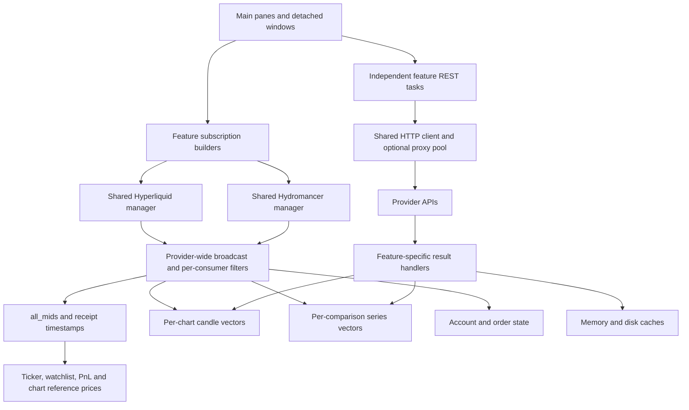

# Market data, rate limits, and recovery audit

Date: 2026-09-21. The findings below record the pre-fix audit. Implementation status is tracked separately here.

Reported layout: three candlestick charts and five comparison-chart series. The
problem occurs with both Hyperliquid and Hydromancer selected. Whether the live
watchlist, screener, Portfolio pane, secondary chart series, or other consumers
were open during a failure is not established.

## Assessment

The code contains several concrete recovery gaps and sources of redundant REST
traffic. They explain how one chart can stop while the ticker and PnL continue,
without requiring an excessive number of open charts. The exact trigger in a
particular incident still needs per-topic and per-request runtime evidence.

The most urgent changes are per-series recovery and application-wide REST
scheduling. The application already multiplexes and reference-counts identical
websocket subscriptions; replacing that with more sockets would not address the
main findings.

The initial audit did not change application source. The subsequent fixes are
summarized below. No account credentials, personal configuration, or private
traffic were inspected, and no exchange load test was performed.

## Implemented recovery and traffic controls

- `api/read_control.rs` admits info reads through a process-wide weighted rolling
  minute budget: 900 Hyperliquid weight total, at most 700 for background reads.
  Account state and order-status reads retain 200 weight of headroom and two
  concurrency slots; background reads have four slots. Admission waits are
  bounded to 30 seconds, then return a recoverable error. Exchange writes are
  outside this queue. Hydromancer info reads share concurrency and cooldown
  controls without assuming an unknown subscription tier's numeric REST budget.
- Direct HTTP 429 responses apply `Retry-After` to other reads of that provider.
  Proxy responses keep their existing per-route cooldown; every proxy attempt
  also passes admission. The budget is deliberately conservative across proxies.
- `api/shared_reads.rs` retains complete public context snapshots for five seconds
  and DEX metadata for sixty seconds. Chart headers, watchlists, screeners, and
  ticker statistics share these responses and concurrent requests. Private
  account responses are excluded. The cache is bounded, cancellation releases a
  waiting consumer, and errors are briefly shared as errors, never fresh data.
- Candle requests share concurrent identical provider/credential/symbol/interval/
  range reads, with a one-second freshness ceiling. Range bounds are normalized
  to seconds. Disk-cache verification rules remain intact; mids do not fabricate
  OHLCV. Macro histories load only for enabled intervals, and a detached chart
  reuses recently verified source history.
- Comparison subscriptions start independently of history success. A failed
  history keeps its last good series, exposes its error, and retries with backoff.
  Pending requests are registered through `SpaghettiFetchRequested`; completions
  must match the exact request and provider/layout generations. Live candles
  received during history loading win over its older mutable tail.
- Both candle adapters watch their own valid updates. Ninety seconds of silence
  triggers a topic-only resubscription and history verification; sparse spot,
  outcome and monthly streams use five minutes. Heartbeats and other symbols
  cannot reset this timer. Subscription reference counts survive repairs, and
  duplicate repair commands are throttled. Candle consumer lag no longer forces
  the entire provider socket to reconnect. Subscription errors are exposed with
  bounded, redacted messages, and 1s streams never fall back to unsupported HL
  candles after a Hydromancer authentication failure.
- Automatic normal/secondary/comparison recovery retains the display and targets
  only affected series. Pending work and cooldowns suppress repair storms.
  Verified recent histories can reconcile only the overlapping tail (within 200
  intervals); unknown or long-gap histories still need a complete refresh.
  A REST snapshot does not clear the separate live-stream degradation status.

The provider-wide broadcast architecture, account polling cadence, and provider
subscription entitlements remain as before. These controls do not increase a
provider's purchased limits. Topic-indexed dispatch and account-tier admission
are follow-up architecture work if measured workloads justify them; the existing
shared upstream subscription registry remains in use.

Validation uses offline unit and loopback transport tests, including 30 consumers
sharing one read, per-series failure/retry, live-versus-history ordering, topic
silence despite unrelated traffic, preserved subscription refcounts, and shared
cooldown. A GUI startup check uses `--test` (in-memory config, no personal account).

## Final validation

After integrating the concurrent API activity console, funding-header and new
listing changes from `main`:

- `cargo test --package kerosene --bin kerosene`: 4,235 passed, 5 ignored.
- `cargo clippy --all-targets --all-features -- -D warnings`: passed. Two existing
  test-only lint issues (numeric grouping and an unnecessary mutable renderer
  argument) were corrected without changing behavior.
- `cargo fmt -- --check`, `git diff --check`, and `cargo build`: passed.
- Xvfb startup with Wayland disabled, `ICED_BACKEND=tiny-skia` and `--test`:
  confirmed a 1600×960 “Kerosene Trading Terminal” X11 window, no panic, then
  terminated the test process. No personal configuration was loaded.

## Current pipeline



Sharing a transport connection is different from sharing an in-flight request,
parsed market snapshot, or recovery state. Kerosene does the former well in many
places, but the latter remain divided among features.

Existing protections worth preserving:

- Both managers reference-count identical topic/payload subscriptions. The last
  consumer dropping removes the upstream subscription.
- Normal chart candle subscriptions are deduplicated by symbol/interval and a
  received candle is applied to matching primary and secondary chart instances.
- All-mids prices already feed multiple surfaces, including chart market
  reference prices. Wallet detail streams avoid duplicating all-mids subscriptions.
- L2 consumers use canonical precision; arbitrary precision merging would lose
  useful depth or misattribute frames.
- Account refreshes have scoped weight estimates, pending-work guards, and a
  rate-limit backoff. Spot chart-header fallback requests are batched.
- Candle caches distinguish unverified display data from provider-verified
  history and avoid persisting a forming candle as final history.

Evidence: [HL subscription counts](../src/ws/manager/subscriptions.rs),
[Hydromancer subscription counts](../src/ws/hydromancer/manager/task/subscriptions.rs),
[chart subscriptions](../src/subscription_state/market/chart.rs),
[candle fan-out](../src/chart_update/candles/ws.rs),
[mids routing](../src/market_state/mids.rs), and
[cache validation](../src/api_cache.rs).

## Findings, in priority order

### 1. Comparison history failure disables the live series indefinitely

**Confirmed code path; high priority.**

`apply_spaghetti_candles_loaded` handles any REST error by setting
`series.loaded = false`, discarding the error, and removing cached data.
`push_spaghetti_market_subscriptions` subscribes only loaded series. The live
update guard also rejects unloaded series. There is no scheduled retry from the
error handler.

Thus a transient 429, timeout, or provider error can leave one series with no
live subscription while successful siblings continue. Depending on the preceding
operation, that series may disappear or remain unavailable rather than merely
display a frozen line. A loaded series whose upstream stream silently stops is
the separate frozen-line case described below.

**Change:** separate retained history, history request status, and stream health.
Keep live demand active while history is loading or retrying; buffer and merge
incoming candles. Retain the last good history with a visible per-series
degradation state and schedule retries through the shared request budget.

Evidence: [error handler](../src/spaghetti_update/data/candles.rs), lines 71–89;
[subscription gate](../src/subscription_state/market/spaghetti.rs), line 36.

### 2. Connection health masks individual stalled or rejected subscriptions

**Confirmed recovery gap; directly consistent with the reported symptoms.**

The HL manager resets `last_rx_at` for any incoming frame and reconnects after
45 seconds without any frames. Hydromancer likewise measures connection-wide
reads. Continuing mids, books, account traffic, or heartbeats keep the connection
healthy even if one candle topic never delivers again.

Neither manager maintains an acknowledged/failed/awaiting-first-data state for
each desired candle subscription. HL routes `subscriptionResponse` and `error`
frames as generic data; the candle adapter consumes neither. Hydromancer converts
errors into control messages, but its candle adapter falls back only for
authentication errors and otherwise continues without informing the chart.

Normal candle charts do have a stale warning. However, it checks the candle's
scheduled close time plus grace, as well as last observation time. A stopped 1h
candle can appear healthy until its hour ends; there is no autonomous candle
repair in the status tick. Comparison series have only a `loaded` flag and no
last-received timestamp, subscription error, or stale status.

**Change:** track desired subscription, acknowledgement, first-data deadline,
last valid receipt, last market event, and repair state separately for every
provider/symbol/interval. Surface rejected subscriptions. Repair a suspect topic
with bounded resubscription and a small reconciliation request; reserve a socket
reconnect for transport failure or repeated topic failures. Account for inactive
markets, sparse spot trades, market sessions, and event-driven feeds: unchanged
price alone is not evidence of failure.

Evidence: [HL manager](../src/ws/manager.rs), lines 349–429;
[HL frame parser](../src/ws/manager/frames.rs);
[Hydromancer read loop](../src/ws/hydromancer/manager/task.rs), lines 196–254;
[Hydromancer candle controls](../src/ws/hydromancer/market_streams.rs), lines 416–478;
[chart stale warning](../src/chart_views.rs), lines 419–439;
[status tick](../src/chrome_update/status_tick.rs);
[comparison series model](../src/spaghetti/model.rs), line 48.

### 3. Recovery can multiply the work that caused degradation

**Confirmed code paths; load amplification is a risk, not measured here.**

A comparison-series broadcast lag calls `reload_spaghetti_chart` for the entire
comparison. All its series are cleared, marked unloaded, and fetched with
`NetworkOnly`. For the reported five-series comparison, one lag event can produce
five new history requests and subscription churn. A failed sibling can then enter
finding 1. There is an existing guard against repeatedly reloading already
unloaded series, but it does not make the first recovery selective.

Normal-chart gap/lag repair similarly reloads each matching chart instance and
can reload its secondary series too. Reload removes shared cache entries and
clears displayed candles. Queuing a fetch overwrites the expected request without
cancelling older network work. Retryable normal-chart requests get four attempts
with delays of 0, 1, 3, and 8 seconds, including 429 responses; there is no shared
cooldown on the direct path.

**Change:** deduplicate recovery by data key, repair only the affected range and
series, preserve last-good display state, and merge buffered live updates. Retry
according to typed failure/cooldown state. Cancel obsolete queued work after
symbol, timeframe, layout, or provider changes. Do not discard valid historical
cache pages merely because a live stream lagged.

Evidence: [comparison reload](../src/spaghetti_update/data/reload.rs), lines 31–99;
[normal reload](../src/chart_update/candles/reload.rs);
[gap/lag handling](../src/chart_update/candles/ws.rs);
[fetch queue and retry delays](../src/chart_state/candles.rs), lines 191 and 309;
[retry classification](../src/chart_update/candles/loaded.rs), line 490.

### 4. REST deduplication stops at feature boundaries

**Confirmed redundant work.**

| Consumer | Current request behavior | Sharing opportunity |
| --- | --- | --- |
| Main/secondary candle charts | Refresh requests are per instance and `NetworkOnly` | One in-flight history request per provider, symbol, interval, and covered range |
| Comparison charts | One `NetworkOnly` request per series, independent of normal charts | Subscribe to the same canonical candle series/history service |
| Detached candle windows | Clone existing state, then fetch history and four macro intervals again | Attach to shared data; keep viewport/editor state local |
| Macro levels | Fetch 1h, 1d, 1w, and 1M at startup and symbol changes, without checking whether the corresponding indicators are enabled | Fetch on demand; reuse matching chart history |
| Live watchlist | Refresh short-term history per watched symbol roughly every minute | Reuse valid shared candle history; use shared quote samples only where metric semantics allow |
| Screener | Bootstrap up to ten histories per 15-second batch, then use accumulated mid samples | Share bootstrap requests and sample storage with compatible consumers |
| Session Data | Fetch daily and chunked intraday candles per instance | Reuse overlapping validated history ranges |

The caches help sequential reads, but are not a shared in-flight registry. Two
simultaneous misses can still issue the same request. `NetworkOnly` verification
is intentional: the fix is to share fresh verification, not to treat old cached
history as current.

With three ordinary charts and five comparison series, cold startup can schedule
eight main histories **plus twelve macro histories**, before metadata, account,
secondary-series, and other feature reads. A cache hit may reduce the macro
network traffic; no cache or incident measurements were taken here. Macro reads
call the HL API even when the selected live provider is Hydromancer.

Evidence: [history policy](../src/chart_state/model.rs), line 52;
[comparison fetch](../src/chart_state/spaghetti_fetch.rs);
[macro requests](../src/chart_state/candles.rs), line 49;
[startup](../src/app_boot/chart_instances.rs), lines 73–110;
[detached chart](../src/chart_update/detached.rs), lines 53–63;
[watchlist history](../src/api/watchlist/history.rs);
[screener selection](../src/screener_state.rs), line 309;
[Session Data](../src/market_update/session_data.rs), line 368.

### 5. Full-market responses are repeatedly fetched and partly discarded

**Confirmed; an especially useful reduction for modest layouts.**

Perp chart-header fallback is scheduled per chart every ten seconds while using
REST-sourced context. Each request downloads `metaAndAssetCtxs` for an entire DEX
and extracts one symbol. Three charts on the same DEX can therefore issue three
equivalent requests per refresh. Spot headers already batch this correctly within
the chart feature.

Watchlists, screener, symbol search, ticker favourites, and ticker aggregate
statistics run separate context-fetch paths. Watchlist context requests group
symbols by DEX, but discard unrequested symbols and cache only selected results.
The fifteen-second per-symbol disk cache does not consolidate simultaneous reads
or retain the full response for other consumers. Exchange statistics fetch
`perpDexs`, every perp DEX's contexts, and spot contexts every minute, then retain
only the aggregate totals.

**Change:** one full context snapshot per DEX/spot family, parsed once and shared
by all consumers. Derive ticker totals from those snapshots while tracking family
completeness and freshness. HL's documented `allDexsAssetCtxs` stream is worth
evaluating to replace perp polling; it requires correct universe/index mapping
and leaves spot handling separate. See the
[official subscription specification](https://hyperliquid.gitbook.io/hyperliquid-docs/for-developers/api/websocket/subscriptions).

Evidence: [perp header fetch](../src/api/chart_asset_context.rs), line 27;
[per-chart scheduling](../src/chart_update.rs), lines 479–534;
[filtering full responses](../src/api/watchlist/contexts.rs), lines 154–159;
[exchange statistics](../src/api/exchange_stats.rs), line 41;
[ticker cadence](../src/market_update/ticker_tape.rs), lines 11–14.

### 6. There is no shared weighted request budget for direct API traffic

**Confirmed architectural gap.**

`CLIENT` provides pooling and timeouts. `send_info` routes requests and observes
traffic. The proxy pool honors route cooldowns and `Retry-After`, but direct
requests execute immediately. Proxy in-flight counts choose a less-busy route;
they do not impose an application-wide concurrency/weight cap.

Individual protections do exist: account refresh budgets/backoff, chart-header
backoff, fills pagination delays/retries, and per-feature loading flags. They
cannot coordinate competing features, startup bursts, retries, and provider
fallbacks. The account lane's estimated allowance is not a reservation enforced
against other callers. Portfolio history also polls every five seconds with live
positions, independently of whether background market work is being throttled.

**Change:** central scheduling at the transport boundary with provider and egress
scope, conservative endpoint weights plus response-size accounting, bounded
concurrency, bounded queues, and a shared cooldown on 429. Preserve typed HTTP
status and `Retry-After` instead of relying on string matching. Prioritize
order/cancel safety and account reconciliation, then visible live-data repair,
initial visible history, and background analytics. Reserve capacity for exchange
actions without automatically replaying non-idempotent writes. Allow for other
apps sharing the same IP; local accounting cannot see their usage.

Evidence: [transport](../src/api/proxy.rs), lines 82–160;
[account budget](../src/account/types/data/fetch_scope.rs), lines 78–106;
[account backoff](../src/account_update/connection/refresh.rs);
[portfolio timer](../src/subscription_state/timers/analytics.rs), line 47.

### 7. Local fan-out and lag handling become more expensive with more windows

**Confirmed design; its contribution to the reported incident is unmeasured.**

Every adapter consumes a provider-wide broadcast stream and filters messages
locally. Matching JSON is decoded again by separate feature consumers. The
broadcast capacity is 10,000; downstream candle channels hold ten items. HL
coalesces books, not candles. Slow consumers can therefore lag on the shared bus,
including because of unrelated topics.

Consumer lag requests a reconnect of the whole provider manager. The reconnect
gate coalesces requests only until the reconnect command is dequeued, not for a
complete recovery period. This can turn UI overload into connection churn and
history refetches. More sockets are not the first remedy.

**Change:** dispatch by typed topic once, retain the latest replaceable snapshot,
and fan out shared data to views. Coalesce updates to the same forming candle
while preserving transitions between candle buckets and preserving lossless
order/fill events. Handle local lag locally where continuity can be recovered.
Measure event-loop latency and per-consumer lag before claiming GPU/rendering is
the cause. Consider a separate critical account/order lane if measurements justify
isolation, while respecting shared provider quotas.

Evidence: [broadcast setup](../src/ws/manager.rs), line 198;
[candle adapter](../src/ws/market_streams/candles.rs);
[lag recovery](../src/ws/market_streams.rs), line 103;
[coalescer](../src/ws/manager/coalescer.rs).

### 8. Provider choice and data provenance are only partly unified

**Confirmed routing behavior; important for diagnosing both-provider failures.**

Live read provider and candle backfill provider are separate settings. Selecting
Hydromancer does not move all reads away from HL: all-mids and private user
streams, context polling, macro history, watchlist history, Session Data, and
portfolio reads still have HL paths. Ordinary Hydromancer history failures can
fall back to HL immediately, adding load precisely when repair demand is high.
Hydromancer live-candle fallback is much narrower, mainly authentication failure;
there is no general per-topic health-based fallback/recovery policy.

The optional Hydromancer PnL book stream writes mid prices into the same
`all_mids` map as HL all-mids, with receipt timestamps. This is already useful
reuse, but it lacks an explicit per-quote source and event-order policy. A newer
receipt is not necessarily a newer market event.

**Change:** retain provider, generation, price kind, event/receipt times, and
quality for shared data. Make fallback capability-aware, budgeted, observable,
and subject to hysteresis. In particular, do not send unsupported 1s candle
subscriptions to HL when Hydromancer fails. Preserve account/provider-generation
guards throughout.

Evidence: [provider contexts](../src/read_data_provider.rs);
[history fallback](../src/api/candles.rs), lines 96–184;
[live fallback](../src/ws/hydromancer/market_streams.rs), lines 444–478;
[PnL price reuse](../src/account_update/position_pnl.rs), lines 52–82.

## Quotas and illustrative load

HL documents a shared REST budget of **1,200 weight/minute/IP**, a default weight
of 20 for most info reads, and additional candle weight per 60 returned items.
Websocket limits are separate: 1,000 subscriptions, 2,000 outbound messages/minute,
10 connections, 30 new connections/minute, and 10 distinct users for user streams.
[Official limits](https://hyperliquid.gitbook.io/hyperliquid-docs/for-developers/api/rate-limits-and-user-limits).

Hydromancer currently documents **10/50/100 candle subscriptions per key** for
Starter/Growth/Scale, and **300/3,000/6,000 outbound messages/minute**. The user's
tier is unknown. Eight distinct candle topics are below Starter's limit but leave
little room for secondary series, different intervals, or other users of the key.
[Official limits](https://docs.hydromancer.xyz/readme/websocket/rate-limits-user-limits-and-heartbeats).

These are code-derived examples, not measured user traffic:

| Conditional workload | Approximate HL weight/minute |
| --- | ---: |
| Three perp headers on persistent REST fallback, ten-second refresh | 360 |
| Portfolio pane with live positions, five-second polling | 240 |
| Twenty watchlist symbols needing fresh history each minute | At least 400, before candle-size adders |
| Ticker exchange statistics with D HIP-3 DEXes | 20 × (D + 3) |

The first three together already consume at least 1,000 before ticker statistics,
account refresh, chart loading, or retries. This does **not** establish that those
features were active in the reported incident. It demonstrates why chart count
alone cannot explain or control the request budget. A cache hit or slower serial
history batch reduces actual request throughput.

REST 429s do not, by themselves, prove that an already-subscribed websocket topic
was rate-limited. The app's history-dependent subscriptions and repair behavior
are the bridge between these otherwise distinct failure modes.

## What price data can safely be reused

Use a shared data service keyed by provider/generation, canonical asset ID and
DEX, data kind, interval, and book precision where applicable. Keep viewport,
selection, styles, and render caches per view.

| Data | Valid shared consumers | Constraint |
| --- | --- | --- |
| Mid/bid/ask quotes | Ticker, quote-based PnL, watchlists, chart reference price | Keep quote semantics and freshness explicit |
| Trade-derived candles | Normal charts, comparison/pair charts, compatible indicators and history metrics | Match symbol, interval boundaries, coverage, and source semantics |
| Asset contexts | Headers, watchlists, search, screener, aggregate statistics | Preserve full-family snapshots and field validity |
| Historical mid samples | Quote-based short-term change calculations | Do not silently substitute for trade-open/close metrics |
| Account/order/fill data | Connected account and matching wallet views | Preserve address, generation, completeness, and lossless event handling |

A moving mid-price cannot reconstruct missing traded high/low, trade close,
volume, or missed candle buckets. It can keep a clearly identified live quote or
reference line current while candle history is degraded. An optional quote-based
comparison mode is possible, but silently switching an existing trade-based
comparison to mids would change its meaning. Exact higher-timeframe candles may
be derived from complete lower-timeframe trade candles with tested boundary,
gap, and volume handling; this can reduce distinct subscriptions where practical.

## Proposed implementation sequence

1. **Repair observable failure behavior first.** Add per-series health/error and
   retry state; keep live subscriptions independent of REST success; handle
   acknowledgements/rejections; preserve data and repair only affected topics.
   Add stale/repairing/limited indicators to comparison legend entries and chart
   status. Treat transport connectivity separately from data freshness.
2. **Add shared scheduling and request deduplication.** Start at `send_info` and
   the provider adapters. Introduce typed errors, weighted admission, cooldowns,
   priorities, cancellation, and one shared future per identical/covered read.
   Route startup, refresh, backfill, and fallback through it.
3. **Remove the largest avoidable reads.** Gate macro histories on enabled
   indicators; share candle hydration across windows and comparison series;
   batch contexts by DEX across every feature; derive ticker stats from shared
   snapshots; reduce/background-prioritize historical portfolio polling while
   maintaining explicitly labelled live valuation separately.
4. **Unify ingest and subscription demand.** Introduce a canonical market-data
   store and typed topic dispatcher. Parse once, share snapshots, count unique
   upstream topics, handle provider/tier limits, and decouple subscription
   identity from the lowest-numbered chart instance. Duplicate windows should
   add rendering work, not network traffic for already-covered data.

Do these in separate reviewable changes. Extend the existing cache, generation,
and routing protections instead of replacing them in a single rewrite.

## Instrumentation and acceptance tests

The working tree already contains network-activity instrumentation for provider,
operation, status, latency, and request counts. Extend that work with caller
category, estimated/observed weight, queue delay, cache/shared-request hit counts,
unique topic count, acknowledgement state, last valid update age, lag counters,
and recovery reason. Retain redacted identifiers for private streams; do not log
wallet addresses, credentials, payloads, or credential-bearing URLs. Raw HTTP
request counts alone cannot show weighted budget consumption.

Required deterministic tests with mock HTTP/websocket providers:

- Five comparison series: one history request returns 429, four succeed. The
  failed series retains demand, retries after cooldown, and recovers by itself.
- Stop one candle topic while continuing mids and heartbeats. Only that topic is
  marked degraded and repaired; the entire socket remains available.
- Reject one subscription for quota/capability reasons. Surface the reason and
  queued/fallback state instead of leaving an apparently live series.
- Lag one comparison consumer. Repair one series/range, retain siblings, and
  avoid simultaneous duplicate repairs across windows.
- Open 1, 3, 10, and 30 views of the same symbol/interval. Upstream subscription
  count stays one and concurrent hydration shares one request. Also test growing
  distinct-topic layouts, including 1s/secondary series and provider quotas.
- Close the representative chart, change timeframe/provider/key, and close a
  window during a request. Surviving consumers remain live; obsolete results and
  queued work do not mutate or consume resources for the wrong generation.
- Issue a 429 with `Retry-After` during simultaneous startup, background refresh,
  and fallback. Optional requests wait and reconciliation retains reserved
  capacity; retries do not synchronize into another burst.
- Delay a comparison snapshot until after a newer same-context request or live
  update. Reject superseded responses and preserve the newer candle tail. The
  comparison fetch context currently lacks a per-request sequence number.
- Cover quiet spot markets, session boundaries, complete/gapped histories,
  sleep/wake, replayed/out-of-order candles, and lower-timeframe aggregation.

Success means more windows reuse the same data demand; one failed series has
explicit status and automatic bounded recovery; and background data work remains
within the shared budget under load. The reported three-plus-five layout should
be the first end-to-end reproduction target.

## Validation performed and limits

Inspected subscription assembly, both websocket managers and adapters, data
fan-out, chart/comparison update paths, caches, REST transport/proxy routing,
feature timers, account/portfolio reads, watchlist/screener history, startup and
detached-window hydration, and current telemetry. Checked current official
provider limits and subscription documentation.

Attempted:

```text
cargo test --package kerosene --bin kerosene spaghetti_update::tests -- --test-threads=1
```

Compilation failed before tests ran because existing working-tree network-console
code references unavailable `scrollable::Id` and `scrollable::snap_to` APIs in
`src/console_state.rs` and `src/console_update.rs`. This audit does not modify those
files. No claim of passing tests or runtime reproduction is made. The working
tree was being edited concurrently, so these findings describe the source paths
examined during this audit, not an immutable released binary.
